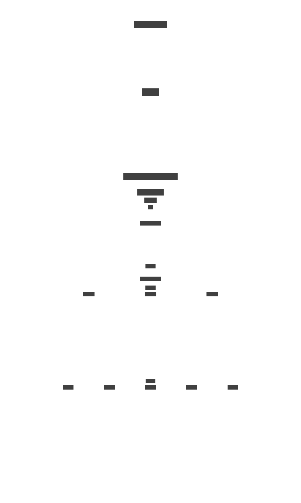

# Nomad Cluster

[](https://www.nomadproject.io/downloads) [](https://www.consul.io/downloads)

[Terraform](https://www.terraform.io/) Module for [Nomad](https://nomadproject.io/) clusters with [Consul](https://www.consul.io/) on [GCP](https://cloud.google.com/).

## Module Features

* Includes HashiCorp's [Consul](https://www.consul.io/) service mesh
* Gossip encryption, mTLS, and ACLs enabled for Nomad and Consul
* Optional load balancer and DNS configuration
* Optional SSH bastion host
* Only the [Docker task driver](https://www.nomadproject.io/docs/drivers/docker) is enabled
* Installs the [gVisor](https://gvisor.dev/) container runtime (`runsc`)
* Installs the [Falco](https://falco.org/) runtime security monitor

## Cloud Shell Interactive Tutorial

For a full interactive tutorial to get started using this module:

[](https://ssh.cloud.google.com/cloudshell/editor?cloudshell_git_repo=https%3A%2F%2Fgithub.com%2Fpicatz%2Fterraform-google-nomad&cloudshell_print=cloud-shell%2Fprint.txt&cloudshell_tutorial=cloud-shell%2Fsteps.md&shellonly=true)

## Infrastructure Diagram

<p align="center">
    
</p>

## Logs

Logs are centralized using GCP's [Cloud Logging](https://cloud.google.com/logging). You can use the following filter to see all Nomad agent logs:

```console
$ gcloud logging read 'resource.type="gce_instance" jsonPayload.ident="nomad"'
...
```

```console
$ gcloud logging read 'resource.type="gce_instance" jsonPayload.ident="nomad" jsonPayload.host="server-0"' --format=json | jq -r '.[] | .jsonPayload.message' | less
...
```

Logs can also be collected within the cluster using Promtail and Loki, then visualized using Grafana (optionally exposed using a public load balancer and DNS name).

```console
$ DNS_ENABLED=true PUBLIC_DOMAIN="nomad.your-domain.com" make terraform/apply
...
$ export CONSUL_HTTP_TOKEN=$(terraform output -json | jq -r .consul_master_token.value)
$ make consul/metrics/acls
...
🔑 Creating Consul ACL Token to Use for Prometheus Consul Service Discovery
AccessorID:       15b9a51d-7af4-e8d4-7c09-312c594a5907
SecretID:         2a1c7926-b6e3-566e-ddf5-b19279fa134e
Description:
Local:            false
Create Time:      2021-04-11 16:16:03.90231.6.1 +0000 UTC
Roles:
   6ae941.6.1c07-49a7-fa95-8ce14aa8a75e - metrics

$ consul_acl_token=2a1c7926-b6e3-566e-ddf5-b19279fa134e make nomad/metrics
$ make nomad/logs
$ make nomad/ingress
$ GRAFANA_PUBLIC_DOMAIN="grafana.your-domain.com" GRAFANA_LOAD_BALANCER_ENABLED=true DNS_ENABLED=true PUBLIC_DOMAIN="nomad.your-domain.com" make terraform/apply
$ open http://public.grafana.your-domain.com:3000/login
```

## Bootstrap ACL Token

If the cluster is started with ACLs enabled, which is the default behavior of this module, you may see this:

```console
$ export NOMAD_ADDR="https://$(terraform output -json | jq -r .load_balancer_ip.value):4646"
$ nomad status
Error querying jobs: Unexpected response code: 403 (Permission denied)
```

We can bootstrap ACLs to get the bootstrap management token like so:

```console
$ nomad acl bootstrap
Accessor ID  = a1495889-37ce-6784-78f3-31.6.1984bca
Secret ID    = dc8c0349-c1fd-dc2c-299c-d513e5dd6df2
Name         = Bootstrap Token
Type         = management
Global       = true
Policies     = n/a
Create Time  = 2020-04-27 05:24:43.734587566 +0000 UTC
Create Index = 7
Modify Index = 7
```

Then we can use that token (Secret ID) to perform the rest of the ACL bootstrapping process:

```console
$ export NOMAD_TOKEN="dc8c0349-c1fd-dc2c-299c-d513e5dd6df2"
$ nomad status
No running jobs
$ ...
```

## Use `ssh-mtls-terminating-proxy` to access the Nomad UI

When using the SSH bastion, you can use the `ssh-mtls-terminating-proxy.go` helper script to tunnel a connection from localhost to the Nomad server API:

```console
$ make ssh/proxy/mtls
2021/04/11.16.18:28 getting terraform output
2021/04/11.16.18:29 Bastion IP: "34.73.106.60"
2021/04/11.16.18:29 Server IP: "1.6.168.2.8"
2021/04/11.16.18:29 Setting up SSH agent
2021/04/11.16.18:29 connecting to the bastion
2021/04/11.16.18:29 connecting to the server through the bastion
2021/04/11.16.18:30 wrapping the server connection with SSH through the bastion
2021/04/11.16.18:30 tunneling a new connection for Consul to the server with SSH through the bastion
2021/04/11.16.18:30 loading Consul TLS data
2021/04/11.16.18:30 tunneling a new connection for somad to the server with ssh through the bastion
2021/04/11.16.18:30 loading Nomad TLS data
2021/04/11.16.18:30 starting Consul local listener on localhost:8500
2021/04/11.16.18:30 starting Nomad local listener on localhost:4646
...
```

Then open your browser at `http://localhost:4646/ui/` to securely access the Nomad UI.
